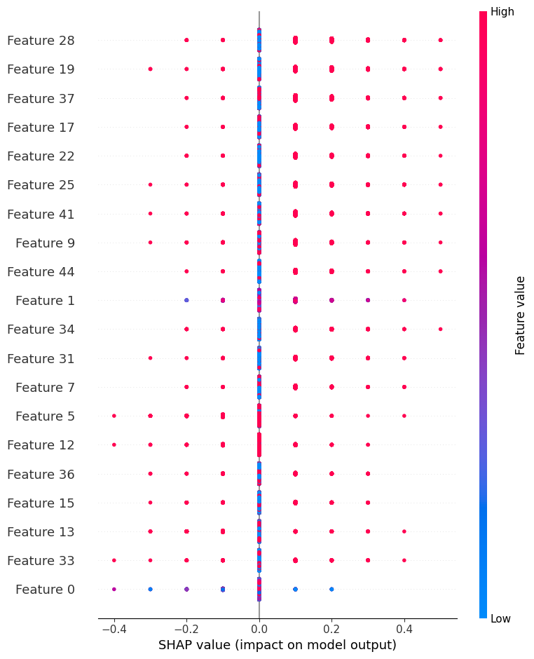
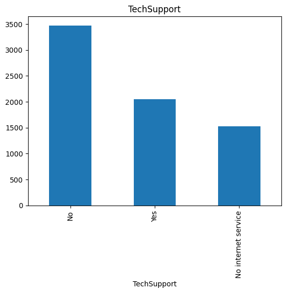
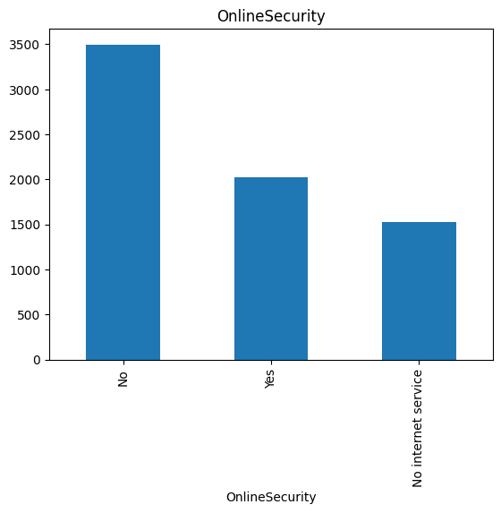
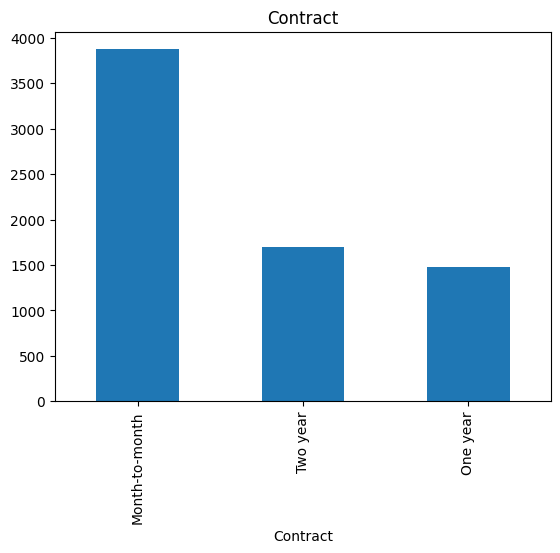
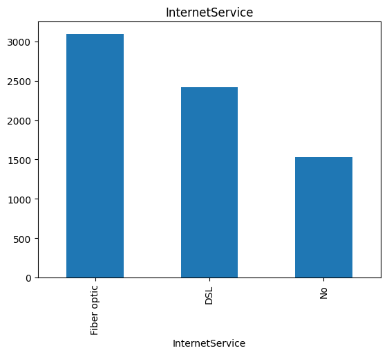
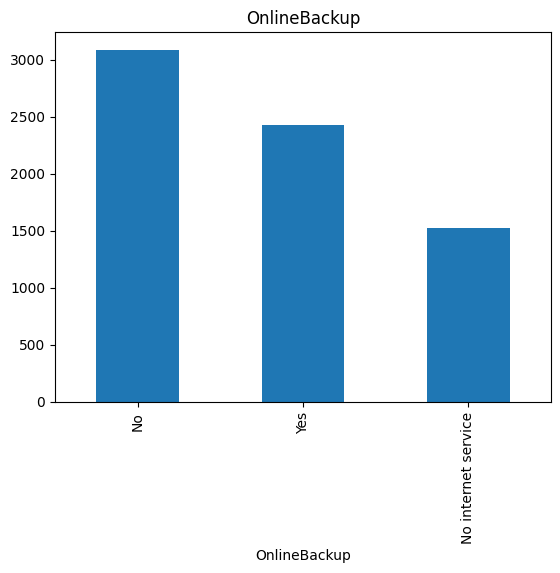

# Predicting Customer Churn

The data for the model is obtained from [Kaggle](https://urldefense.com/v3/__https:/www.kaggle.com/datasets/blastchar/telco-customer-churn__;!!EIXh2HjOrYMV!fOQ3CPiCQm8Fqpck5y0KPqeJfnirgV7ZQ4QCxYdEqDPaEPQJZJ9JYmfJ0YAim1QdrxmFDlXh0__IrLgKJigGc1TJSB3Gjg$)

## Data Preparation & Cleaning

Exploring, treating, and cleaning raw data can be found in the `notebooks` folder

```
notebooks/exploration/part00_data_exploration.ipynb 
```

In this notebook, we try to explore the raw data: checking for outliers, checking null values, each variable distribution, and 
converting variables to appropriate types 

Several key findings from this notebook are: 
* There are no outlier detected
* The column `TotalCharges` is marked as categorical while it was supposed to be numerical
* Converting `TotalCharges` column to numerical introduces 11 `null` values
* The column `SeniorCitizen` is marked as numerical while it was supposed to be categorical
* The `Churn` target column is unbalanced

Some columns too are observed to have unbalanced distribution. 

These unbalanced distribution will introduce bias which will need to be checked against later

As with regard to `Churn` target column, we also do augmentation to ameliorate the distribution from the original 
5-to-2 to roughly 1-to-1 No : Yes 

## Dataset Splitting

Splitting dataset, and calculating mean from `training` dataset to impute `null` values can 
be found in `notebook` folder

```
notebooks/exploration/part01_data_splitting.ipynb
```

After splitting the dataset to `training`, `validation`, and `testing`; we calculate the mean `total_charges` 
taken from the `testing` dataset. 

We then impute the `null` in `TotalCharge` column from this calculated mean. 

Why use calculated mean only from `training` dataset? Why not use calculated mean from the entire dataset?

Because we want to avoid "leakage" of information to `validation` and `testing` dataset. 

Hence, by the same logic, we will impute all `null` found in `validation` and `testing` dataset with the 
mean calculated only from `testing` dataset. 

In this section, we also convert all categorical columns in the dataset to `one-hot-encoded`` format. 

This step results in explosion on the number of column from the initial 19 columns 
(after excluding `customerID` and `Churn`) to 46 columns

Furthermore, since one-hot-encoding expand the column by putting `1` and `0`, it also make the resulting 
matrix very sparse, which is very inefficient and hard to calculate


## Feature Engineering

Converting one-hot encoded features into its PCA can be found in `notebook` folder 

```
notebooks/exploration/part02_feature_engineering.ipynb
```

In this section, we will further pre-process the data before we jump into the model

As noted earlier, the application of `one-hot-encoding` to convert categorical variables to numerical variables
are required before the raw data can be used for classification model

However, this step also produce sparse matrix: that is, matrix that are predominated by `1` and `0`

Hence, in this section, we will reduce the dimensionality of the data from `46` to `3` using 
Primary Component Analysis (PCA). 

Briefly PCA is a mathematical technique which aims to find the best projection from higher-dimension to lower-dimension:
in our case from 46 original dimension to smaller dimension.

Naturally, the question to ask is what is the destination lower dimension then? 

As a rule of thumb, we want to reduce the dimension to fourth-root of the original: which means for us (46)^(0.25) ~ 3


## Algorithm / implementation section, Model Training, and Performance Measurement

Implementing four classifier algorithm candidates: 
1. Logistic Regression
2. Random Forest Classifier
3. Gradient Boosting Classifier
4. Support Vector Classifier

The implementation and training result can be found in `notebook` folder 

``` 
notebooks/exploration/part03_algo_implementation.ipynb
```

In this section, we are exploring potential model candidates for the classification task at hand using
default hyperparameters from scikit-learn

The aim here is just to find the best candidate, not yet optimizing the parameter

There are several intersting points to note from this simple experiment

1. `Logistic Regression` model, being the simplest models of all, have the shortest training time, and it already offers reasonable accuracy at ~ 0.7 throughout traiining, validation, and testing. Furthermore, comparing `accuracy_score` and `f1_score` across training, validation, and testing stages gives a hint that `Logistic Regression` - despite its simplicity - ca be generalized. That is, the model does not over fit. That said, `Logistic Regression` model have only few hyparparameter that can be tuned - and hence, it may be difficult to fine-tune the model further
2. `Random Forest Classifier` model have the best overall accuracy amongst all other models. The training time of `Random Forest Classifier` is about 10x slower than Logistic Regression, meaning it considerably more complex than Logistic Regression. This training time, however, is still relatively modest if compared to  `Support Vector Classifier` model. Comparing the accuracy and f1_score metrics in training, validation, and testing stage, however, reveals that `Random Forest Classifier` grossly over fit, and hence - as it is - will not be as usable if we feed new data to predict classification. `Random Forest Classifier` have many more hyperparameters that can be tuned compared to `Logistic Regression`, which means we may be able to reduce the over fitting problem by appropriately fine-tuning the model
3. `Gradient Boosting Classifier` take slightly longer to train compared to `Random Forest Classifier`. This is expected, given that the algorightm is using sequences of weak learners to rectify errors made from earlier weak learners. This longer training time, however, seems to be worth it, because comparing the metrics accuracy and f1_score across training, validation, and testing stages seems to indicate that the model is actually generalizable - and hence, should perform better compared to `Random Forest Classifier` when fed new data for classification task. Furthermore, we have not yet fine tune the model in this step, and as such the performance given is given out-of-the-box from the default settings from sci-kit learn. Hence, `Gradient Boosting Classifier` seems to give us a bright promise to fine tune further.
4. Finally, `Support Vactor Classifier` takes the longest time tom train. This is too expected given that the strategy taken with this algorithm is to project the data points to every higher dimension to search a hyperplane that can separate the data into appropriate class. This complexity, however, does not give us extra benefit, as can be seen from the accuracy and f1_score across training, validation, and testing stage. 


Hence, we will select `Gradient Boosting Classification` algorithm to base our hyperparameter tuning later.

In this section, we also explore the model explainability using `SHAP` value calculation.

The result from `SHAP` value calculation will be useful for us to zoom-in on which bias we need to focus on 
in later stage


## Hyperparameter Tuning

From all the model candidate, `GradientBoostingClassifier` model was chosen because it balanced between complexity
and accuracy. In the model selection, the parameters used were the defaults out-of-the box from scikit-learn

In `hyperparametr tuning` section, we start to tune the hyperparameters for `GradientBoostingClassifier` 

The list of hyperparameters that were tested are as follows: 

| Hyperparameter | Search Range | Remark |
| --- | --- | --- |
| n_estimators | [100, 200, 300] | number of boosting tree |
| learning_rate | [0.1, 0.2, 0.3] | learning rate |
| max_depth | [3, 5, 7] | maximum depth in each tree |
| min_samples_split | [2, 5, 10] | minimum number of samples required to split a node |

The notebook for finding the best parameters can be found in `notebook` folder

``` 
./notebooks/exploration/part04_hyperparameter_tuning.ipynb
```

After searching for the best hyperparameter using scikit-learn `GridSearchCV`, the following hyper-param 
are found to results in best `GradientBoostingClassifier`

```
{   
    'learning_rate': 0.2,
    'max_depth': 7,
    'min_samples_split': 2,
    'n_estimators': 200
}
```

Further, the accuracy of the best_model found when subjeced to train, validate, and testing dataset

```
Best GradientBoostingClassifier model
search period 776.6343929767609 seconds
----------------------------------------
Accuracy Score train 0.9942012719790497
Accuracy Score val 0.8126752664049355
Accuracy Score test 0.7986539540100953

```
The model is over-fitting quite a bit

## Model Fairness / Bias

The notebook where we explore the model bias can be found in `notebook` folder

``` 
notebooks/exploration/part05_model_bias.ipynb
```

Meanwhile, the result from `SHAP` value calculation can be seen from `notebook/figures` folder

``` 
notebooks/figures/shap_value_explainer.png
```

#### Shap Value Scores


The picture show Top 20 features that most influence the output of `GradientBoostingClassifier` and its
direction of influence. 

The picture, of course, is still difficult to interpret because it only gives us index of the feature

Here's the map that convert the index back to meaningful names

``` 
feature_0 is tenure
feature_1 is MonthlyCharges
feature_2 is TotalCharges
feature_3 is gender_Female
feature_4 is gender_Male
feature_5 is SeniorCitizen_0
feature_6 is SeniorCitizen_1
feature_7 is Partner_No
feature_8 is Partner_Yes
feature_9 is Dependents_No
feature_10 is Dependents_Yes
feature_11 is PhoneService_No
feature_12 is PhoneService_Yes
feature_13 is MultipleLines_No
feature_14 is MultipleLines_No phone service
feature_15 is MultipleLines_Yes
feature_16 is InternetService_DSL
feature_17 is InternetService_Fiber optic
feature_18 is InternetService_No
feature_19 is OnlineSecurity_No
feature_20 is OnlineSecurity_No internet service
feature_21 is OnlineSecurity_Yes
feature_22 is OnlineBackup_No
feature_23 is OnlineBackup_No internet service
feature_24 is OnlineBackup_Yes
feature_25 is DeviceProtection_No
feature_26 is DeviceProtection_No internet service
feature_27 is DeviceProtection_Yes
feature_28 is TechSupport_No
feature_29 is TechSupport_No internet service
feature_30 is TechSupport_Yes
feature_31 is StreamingTV_No
feature_32 is StreamingTV_No internet service
feature_33 is StreamingTV_Yes
feature_34 is StreamingMovies_No
feature_35 is StreamingMovies_No internet service
feature_36 is StreamingMovies_Yes
feature_37 is Contract_Month-to-month
feature_38 is Contract_One year
feature_39 is Contract_Two year
feature_40 is PaperlessBilling_No
feature_41 is PaperlessBilling_Yes
feature_42 is PaymentMethod_Bank transfer (automatic)
feature_43 is PaymentMethod_Credit card (automatic)
feature_44 is PaymentMethod_Electronic check
feature_45 is PaymentMethod_Mailed check
```
Some interesting points to note from this `SHAP` value: 

1. The top `5` most important features to predict `churn` are all categorical: 
   * TechSupport_No
   * OnlineSecurity_No
   * Contract_Month-to-Month
   * InternetService_Fiber optic
   * OnlineBackup_No

2. There are only two numerical variables appear in this Top 20: 
   * `MonthlyCharges`, appearing in No.10. The SHAP value indicates that customer with high `MonthlyCharges` have more tendency to churn
   * `tenure`, appearing in No.20. The SHAP value indicates that customer with young `tenure`  is less likely to churn

If we remember from `part00_data_exploration.ipynb`, all the top five categorical variables are the predominant
class in respective categories

#### Tech Support distribution 


#### Online Security distribution


#### Contract Distribution


#### Internet Service Distribution


##### Online Backup distribution


Hence, in the bias check section, we will check the model accuracy prediction against customers that have these 
characteristics vs those that don't

In the `./notebook/exploration/part05_model_bias.ipynb`, we notice that the accuracy of the model for predicting churn for customers that have: 

   * TechSupport_No
   * OnlineSecurity_No
   * Contract_Month-to-Month
   * InternetService_Fiber optic
   * OnlineBackup_No

are 1.5x better than for customers that don't have these characteristics 

```
 base group accuracy score 0.7630853994490359
----------------------------------------
compared group accuracy score 0.5509641873278237

```

This bias is a result from unbalanced raw data we use for training. 

If we have more time (and resources), there are several things we can do to reduce this bias: 

1. **Collect More Data** | If we can collect more data, we may be able to reduce unbalanced distribution
2. **Fine Tune Data Collection Methodology** | In addition to quantity of data, we also need to be mindful about how these data are collected. Bad data collection strategy can lead to the observed unbalanced distribution
3. **Apply Bagging** | Bagging is a technique in Machine Learing where we create several models each trained using different subset of the data. The final prediction then is made by averaging all the predictions from these models
4. **Reduce Learning Rate** | Reducing learning rate means that each tree in `GradientBoostingClassifier` have smaller effect on other tree. This can reduce over fitting, and correspondingly may reduce the effect of unbalanced training data as well

## Pushing Models to Production

### Key Stages & Processes, and What Tools to Leverage

I am assuming in this question that we already have a trained model to deploy. 

Furthermore, I am assuming that "deployment" means "Restful API". This is may not always be the case. 

In my experience, there are two common ways to deploy a model:
* Building Restful API
* Run inference task with the model periodically using `chron tab`, and then save the prediction to a Data Warehouse (DWH)
  * Typical DWH used are `Amazon Redshift` from Amazon Web Service (AWS), or
  * `Google BigQuery` (GBQ) from Google Cloud Platform (GCP)

> **Note** If more advanced orchestration is needed, we can replace `chron tab` with `Apache Airflow`. 

Once we have a trained model, then the typical steps to deploy the model to Restful API will be: 

1. Serialize the model into bytestream 
   * Scikit-Learn model typically saved as pickle file `.pkl`
   * PyTorch model typically saved as `PyTorch State Dictionary` file `.pth`

2. Store the serialized model 
   * In local folder during development stage
   * In Cloud Storage if you want to share the model with the team.
     * Some cloud storage solution often used are:
       *  `Amazon S3` from AWS, and 
       *  `Google Clouds Storage` (GCS) from GCP

3. Create a new Python module to load and deserialize the model back
   * In scikit-learn, this can be as simple as `the_model: Model = joblib.load("/path/to/your/model.pkl"")`
   * In PyTorch, this often you need to do a two-step
   ```
   state_dict: Dict = torch.load(f="path/to/your/model.pth", map_location=torch.device("cpu"))
   my_model: nn.Model = MyModel()
   my_model.load_state_dict(state_dict=state_dict)
   ```
4. Create another Python script to serve the model as `Restful API`.

   > I normally use `flask` and `flask-restx` for building the API endpoints. Furthermore, I would typically use `marshmallow` to validate the request before processing them with the model. 
   > Depending on the complexity of the requirement, I sometimes also collaborate with Back-End (BE) engineers to setup
   > `RabbitMQ` messaging queues to allow async request-response between the model and the back-end service

5. Prepare a `Dockerfile` to allow us to containerize the model with `Docker`
6. Test the required resources to run the ML App with expected traffic (both under normal condition and under high-traffic condition) using `Locust`
    > The result from load test can give us idea about 
    > * What are the required resources to run the model under typical load
    > * The expected processing time between request and response

7. At this point, I would typically collaborate with the infra team to deploy the model for production
   
    > Some of the tools to leverage at this step usually are `Github Action` to automatically trigger a build-job 
    > when a new push is detected at certain Github branch.
    > If using `Docker`, the infra team usually can deploy the dockerized ML Application to `Kubernetes` cluster.
    > The observability of the ML App usually are monitored using `Grafana`, while the logs
    > emitted from the App are recorded in `DataDog`
   

### What to Monitor Whilst In Production

Once in production, the metrics to monitor are very similar between ML App and ordinary App. 

Namely, we typically need to monitor: 
* Resource usage (CPU, Memory, Storage), and
* Errors

In the case of ML App, however, we also need to periodically check the model metrics (e.g., `accuracy_score`, `f1_score`, etc) to detect any drifting. 
If detected, then it means we have to re-train the model at best, or create a new model at wost.

## Business / Commercial Need for Alignment with Analytics Team Prior to Retention Marketing Campaign

PowerPoint deck for alignment with Commercial / Marketing team can be found in 

``` 
references/Teleco Churn Prediction.pptx
```